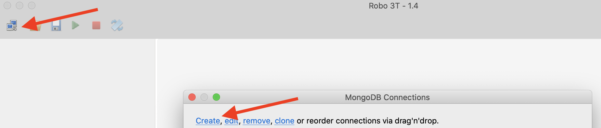
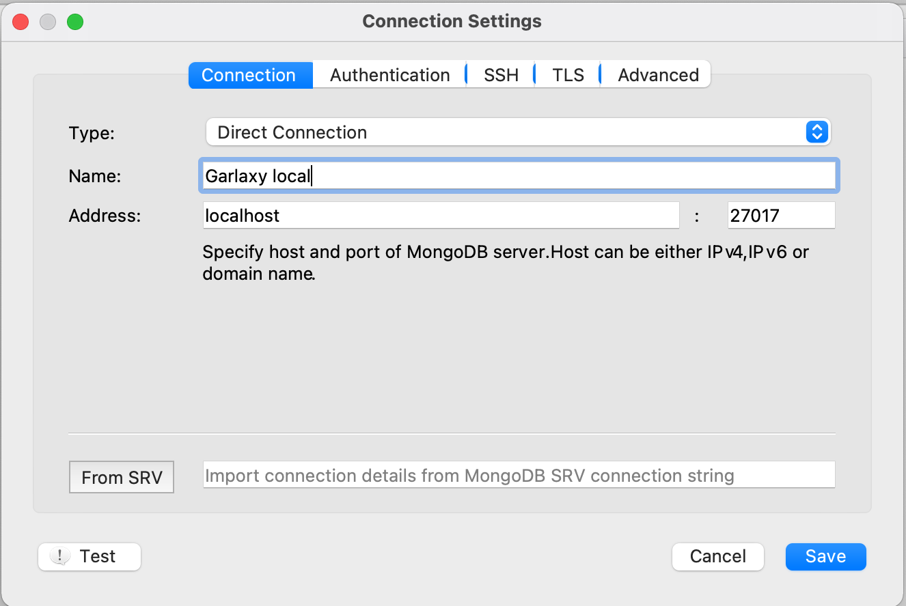
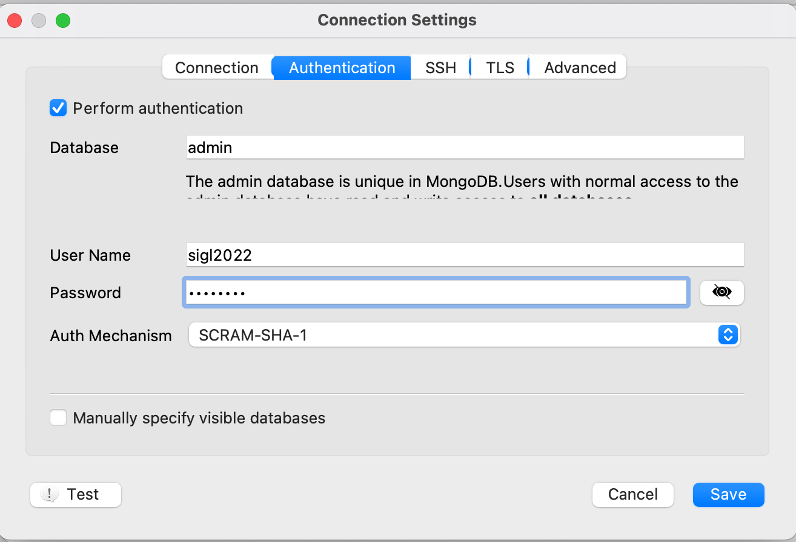
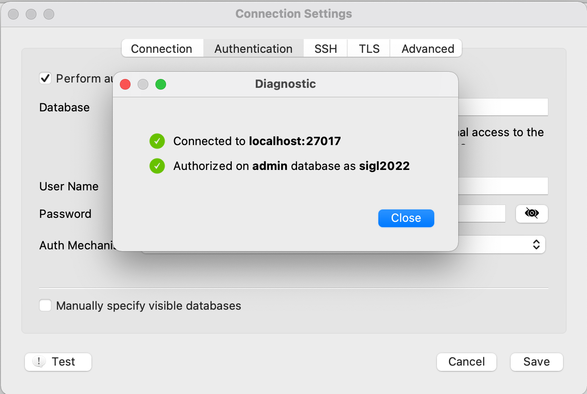
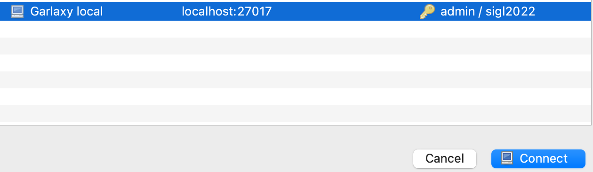
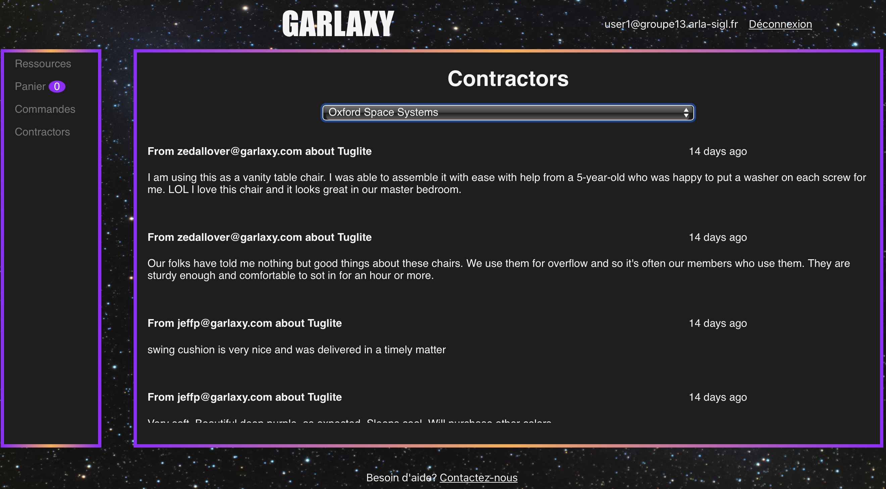
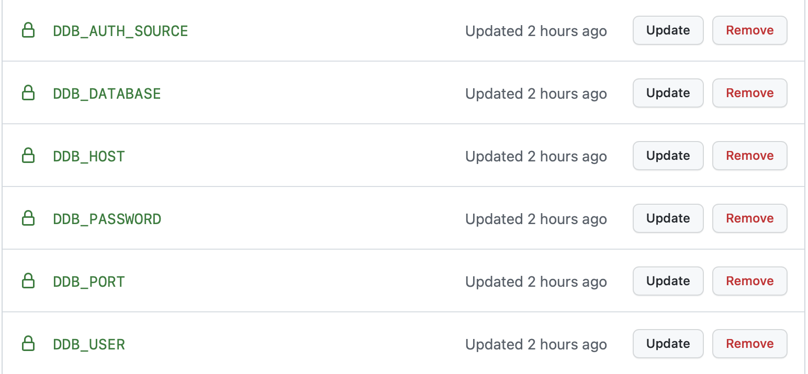

# MongoDB workshop

MongoDB is a NoSQL database, document oriented.

Find out more about some use cases Mongo is good for here:
- https://www.mongodb.com/use-cases

You will use this database to hold all comments written by users on contractors.

## Step 1: Install Mongo

### Start mongo in a container

Like for postgres, you will use a docker setup.

We will create a docker volume to persist mongo data between restarts of the mongo container

Use the `docker-compose` provided:

```bash
# create docker volume for mongo
docker volume create garlaxy-mongo-data
# start containers
docker-compose up -d
```

### Query mongo

#### Using mongo CLI

If you wish to visualized your data directly using MongoDB shell (CLI),
you can enter the MongoDB running container:

```bash
docker exec -it mongo-5 mongo --username sigl2022 --password sigl2022
# >
# MongoDB shell version v5.0.3
# ...
# > 
```

Mongo CLI doc can be found on mongodb website:
- https://docs.mongodb.com/manual/mongo/#working-with-the-mongo-shell


#### Using Robot 3T (formally robotmongo)

Let's install a tool like pgAdmin for mongo.

We recommend using [Robo 3T free tool (download Robo 3T - not studio)](https://robomongo.org/download).

Once downloaded, you can add your mongo connection by:
1. click the connection icon and `create` a new connection. 

1. In the `Connection` tab, add `Garlaxy local mongo` as a connection name (you can choose whichever name you like)


1. In the `Authentication` tab, tick `Perform authentication` and fill:
    - `admin` as database
    - `sigl2022` as User Name
    - `sigl2022` as Password
    - `SCRAM-SHA-1` as Auth Mechanism

1. Test your connection by clicking `! Test` button; you should see:

1. Save config if test is green as above, and you should be able to connect to your mongo db from the list of connections:

1. Click connect, and you should have only a `config` collection and a `System` folder.

## Step 2: Create garlaxy's database and comment collection

### Create garlaxy database in Mongo

From Robot 3T, you can directly create a new database:
1. right click `Garlaxy local mongo` > `Create database`
1. enter `garlaxy` as database name

### Create a schema ?

**There are no notions of database schema in MongoDB!**

You only talk about `collection` of `documents`.

### Create the comment collection

Let's create a collection name "comments" inside garlaxy database, from Robot 3T:
1. click `garlaxy` > right click `Collections` > add `Collection`
1. add `comments` as Collection name

You're all set!

> Note: Equivalent to create a new database with collection using MongoCLI would be:
> ```sh
> # Enter the mongo shell
> docker exec -it mongo-5 mongo -u sigl2022 -p sigl2022
> # MongoDB shell version 5.0.3
> #...
> use garlaxy
> # switched to db garlaxy
> db.createCollection("comments");
> # { "ok" : 1 }
> show collections;
> # will display your collections
> show databases; 
> # will display your databases
>```

## Step 3: Load some comments

We've prepared a script to load all comments based on a [csv file of 16000+ walmart product review, on data.world](https://data.world/opensnippets/walmart-products-reviews-dataset).

> Note: comments are not really matching our garlarxy ressources, but it will do for our case!

This script is based on large file that we can't push on this repository.

Download [comments.tsv (https://files.groupe13.arla-sigl.fr/data/comments.tsv)](https://files.groupe13.arla-sigl.fr/data/comments.tsv) file and place it inside `scripts/data/comments.tsv` folder.

To import those comments, you need to copy scripts folder (containing comments.tsv) inside the mongo container and import them using [mongoimport](https://docs.mongodb.com/database-tools/mongoimport/):
```bash
# from mongodb/
# copy your comments.tsv file to mongo-4 container
docker cp scripts mongo-5:/tmp/
# Load all comments to the garlaxy database on the collection comments.
# Note: you need to authenticate as the user sigl2022 over the admin database to have
#       rights to perform data import.
# --drop is there to empty the collection before importing it again.
docker exec -it mongo-5 mongoimport -u sigl2022 -p sigl2022 \
    --authenticationDatabase=admin \
    --db=garlaxy --collection=comments \
    --type=tsv --headerline --file=/tmp/scripts/data/comments.tsv \
    --drop
```

From Robot 3T, you can view all documents by double clicking on `comments` (or right click on `comments` > View documents)

> Note: You can choose different display options of your documents next to pagination menu

## Step 4: Query comments

Let's query all comments on the contractor with the name `Made In Space Europe`.

In the MongoDB cli or from Robot 3T, enter:
```js
// If you are from MongoDB cli, make sure to type `use garlaxy` before
// (to be on the correct database) 
db.getCollection('comments').find({contractor: "Made In Space Europe"});
```

> Note: You may have noticed that documents are like JSON documents but with some other types like `ObjectID`.
> The real format name of documents in Mongo is [BSON](https://www.mongodb.com/json-and-bson). It stands for Binary JSON, and adds more than > the 5 types of JSON (like `Date`, `NumberLong` etc...)

## Step 5: Integrate comment database to your Web API

You want your web-api to read comments you've imported in mongo.

To interact from your node api with mongo, you will use the [mongodb](https://www.npmjs.com/package/mongodb) node module.

You will also install [body-parser](https://www.npmjs.com/package/body-parser) node modules, necessary for next step (to read/parse incomming POST body).

From your group's project, go in backend/ folder and install mongodb node module:
```sh
# from backend/
nvm use v16
npm i --save mongodb body-parser
```

Then adapt the following changes:
- Add your database connection credentials to your existing  `backend/.env` file:
```sh
# inside backend/.env
# ...
DDB_HOST=localhost
DDB_PORT=27017
DDB_DATABASE=garlaxy
DDB_USER=sigl2022
DDB_PASSWORD=sigl2022
DDB_AUTH_SOURCE=admin
```
> Note: you can check [how group 13's .env file looks like](https://github.com/arla-sigl-2022/groupe-13/pull/4/commits/fc503050e99ba60adcaf638ac71cad3ed7934d6c#diff-1be57eb01a2c4a2d25ef8d2f4caada9bea1eefb6df15f8c37ac385b92708844a)
- [backend/src/database.js](https://github.com/arla-sigl-2022/groupe-13/pull/4/commits/fc503050e99ba60adcaf638ac71cad3ed7934d6c#diff-f74254c83354678ae4a3a3205ddab3712d159c21db220b4793073cd2f429b8c9):
    - adds a new `DDB` object (DDB stands for Document Database) exposing method to query mongo
    - adds a new `getContractors` method in the RDB database necessary for next step
- [backend/src/server.js](https://github.com/arla-sigl-2022/groupe-13/pull/4/commits/fc503050e99ba60adcaf638ac71cad3ed7934d6c#diff-36e2c2dd1e67a7419cef780285f514e743e48ac994a01526288acd31707e09ae)
    - Exposes GET `/v1/contractor` route; get contractors that delivers garlaxy ressources
    - Exposes POST `/v1/contractor/comment` route: get a page of comments for a given contractor (base on its name)

## Step 6: Create a new view to display contractor's comments

**Objective**: Create a new contractor tab where user can select a contractor and read latests comments:


You may have noticed the `... days ago` in the comment's date. 

You will be using [date-fns](https://www.npmjs.com/package/date-fns) node modules to format dates.

From your group's frontend folder:
```sh
# from frontend/
nvm use v16
npm i --save date-fns
```

From your group's frontend project, adapt the follwing changes:
- [frontend/src/App.css](https://github.com/arla-sigl-2022/groupe-13/pull/4/commits/fc503050e99ba60adcaf638ac71cad3ed7934d6c#diff-a335e6772310196bfa0c52a745f82a727e22185ac26025ee94a46364f7fe09aa): add css class to style comment list
- **New file** [frontend/src/Comments.js](https://github.com/arla-sigl-2022/groupe-13/pull/4/commits/fc503050e99ba60adcaf638ac71cad3ed7934d6c#diff-f945a5050ddd677cd0debbde2c22bcad706f018d766a18d8a37f8546fa305f83): Component that fetch and displays comments base on a selected contractor
- **New file** [frontend/src/Contractors.js](https://github.com/arla-sigl-2022/groupe-13/pull/4/commits/fc503050e99ba60adcaf638ac71cad3ed7934d6c#diff-d8b9e8dd61c5a6119a034a97785e1db6058e4884082c8b6ef520b801fbed63bf): Component that fetch and displays contractors in a dropdown button
- [frontend/src/Content.js](https://github.com/arla-sigl-2022/groupe-13/pull/4/commits/fc503050e99ba60adcaf638ac71cad3ed7934d6c#diff-6ee7f9aad46ed7e9368b1c441b405d6ba99294a53013fea551657d30943ea3ad): adds the new `Contractor` routing rule
- [frontend/src/SideMenu.js](https://github.com/arla-sigl-2022/groupe-13/pull/4/commits/fc503050e99ba60adcaf638ac71cad3ed7934d6c#diff-b7e652542a10eb8cbb6db6af86f6f783bc0bd6147a56c883de33e9e1d0a8bd08): Adding the `Contractor` menu to the side menu.

Run your frontend (make sure your backend and databases are running locally):
```sh
# from frontend/
nvm use v16
npm start
```

Run your frontend locally, and you should be able to see comments on contractors!

## Step 7: Adapt your web-api for production Mongo DB

**Objective**: Like for postgres, you want your web-API to read from the production database when your web-API is deployed on production (e.g. on your group's Scaleway machine).

Like for postgres, we prepared a Mongo database where your web-api can read from in production.

Credentials are (adapt XX with your group number):
- Database host (`DDB_HOST`): pro.mongo.arla-sigl.fr
- Database port (`DDB_PORT`): 27017
- Database name (`DDB_DATABASE`): groupe-XX
- Database user (`DDB_USER`): groupe-XX
- Database password (`DDB_PASSWORD`): groupe-XX
- Databae auth source (`DDB_AUTH_SOURCE`): groupe-XX

Create the secrets above in your Github's group project Settings > Secrets. You should have those settings created:


You only have to adapt the existing `.env creation step` in your github workflow.:
- [.github/workflows/main.yml](https://github.com/arla-sigl-2022/groupe-13/pull/4/commits/fc503050e99ba60adcaf638ac71cad3ed7934d6c#diff-7829468e86c1cc5d5133195b5cb48e1ff6c75e3e9203777f6b2e379d9e4882b3): adds mongo's `DDB_` variables from your github secrets

You should be all set!

Just commit/push and you should be able to read comments from your group's project URL (e.g. groupeXX.arla-sigl.fr)
