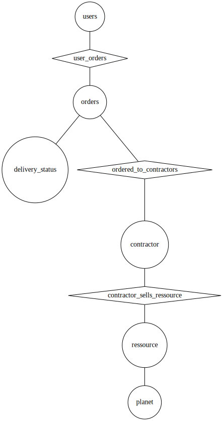

# Postgres (or PostgreSQL) workshop

[Postgres](https://www.postgresql.org) is an open source relationnal database managment system (RDBMS).

It's totally free and is use in production by many. This is the brother of MySQL/MariaDB.

In this workshop, you will:
- Create Garlaxy's database schema
- Import test data we've created for you
- Visualize this data using [pgAdmin](https://www.pgadmin.org)
- Query some data from the web API of previous workshop

## Step 1: Run Postgres and pgadmin on your computer

Postgres is your relationnal database where pgAdmin is a simple UI to help you manage your database (query, table creation etc...).

Instead of installing directly Postgres and pgAdmin on your local machine, you will run those in containers.

### docker-compose, docker network and docker volumes

We've created the [docker-compose.yaml](./docker-compose.yaml) for you.
> Note: [docker-compose](https://docs.docker.com/compose/) is a CLI tool that allows you to run multiple containers, describe in a `docker-compose.yaml` (or `docker-compose.yaml`)file.

Because pgAdmin docker image needs to access postgres docker image, they need to be on the same [docker network](https://docs.docker.com/network/).

Create a new external docker network for postgres:
```sh
# creates the postgres docker network
docker network create garlaxy-postgres
```

Second, create two [docker volumes](https://docs.docker.com/storage/volumes/):
- postgres-data: to store postgres data to avoid losing it every time your restart postgres container
- pgadmin-data: to store pgAdmin configurations, to avoid losing your config every time you restart pgAdmin container

```sh
# create postgres-data volume
docker volume create garlaxy-postgres-data
# create pgadmin-data volume
docker volume create garlaxy-pgadmin-data
```

Then, you can just run containers describe in `docker-compose.yaml` by typing:
```sh
# start containers describe in the docker-compose.yaml file
# in daemon mode. Meaning, you'll start your containers in background
docker-compose up -d
# Creating pgadmin4    ... done
# Creating postgres-14 ... done
```

Check if your containers are running:
```sh
docker ps
# you should see your two containers in the list
```

> Note: if you need to redo or delete evrything:
> - `docker-compose down` will remove all running container but NOT volumes and network, since they are external
> - `docker volume rm garlaxy-postgres-data` to delete postgres data
> - `docker volume rm garlaxy-pgadmin-data` to delete pgadmin data
> - `docker network rm garlaxy-postgres` to delete postgres's docker network

### Connect to your database with pgAdmin

You should be able to access PgAdmin on [localhost:8040](http://localhost:8040/)
- usermail: arla@sigl.fr
- password: sigl2022

For PostgreSQL instance running locally, credentials are:
- user: sigl2022
- password: sigl2022

> Note: default credentials are in the docker-compose file

Once logged in add the local PostgreSQL:

1. Add server: right click on Servers > Add server

2. Enter a connection name (e.g. local)


3. Add the postgres containers info (user, password are both sigl2022)


4. You should see postgres schema and sigl2022 schema in the server dropdown:


## Step 2: Create Garlaxy's database schema

First, let's create a database named `garlaxy`, using pgAdmin:
- Right click on `Databases` under Server > local
- Select `Create`
- just set the name to `garlaxy` and some comment if you want.
> Note: if you currious about how to do it in raw SQL, you can see real SQL code in the SQL tab
- click `Save`


Then, let's create Garlaxy's database core schema, with the following specifications:
- A **user** can have one or more **order**
- An **order** is made to one or more **contractor**
- An **order** has a **delivery_status**
- A **contractor** is associated to one or many **ressource**
- A **ressource** belongs to one **planet** only

Here is the corresponding entity-relation diagram (ERD), without table attributes:



We've prepared a script to create those tables: [create-table.sql](scripts/create-tables.sql).

To run it, you need to send it to your docker container and run a `psql` command from there:
```sh
# First copy scripts to your running postgres container
# from postgresql/
docker cp scripts postgres-14:/tmp/
# create tables by running the create-table scripts over
# your garlaxy database
docker exec -it postgres-14 psql -U sigl2022 -d garlaxy -f /tmp/scripts/create-tables.sql
```

You should see your tables in pgAdmin, under:
Server > local > databases > garlaxy > Schemas > public > Tables

Now we've created all tables, we need to add some data to it.

## Step 3: Import test data to your database

You will use the [COPY](https://www.postgresql.org/docs/12/sql-copy.html) command of postgres to import some data that we provided you with.

> Note: All test data lives under this `scripts/data` folder. It includes:
> - 25 planets from previous workshop
> - 26 resources from previous workshop
> - 140+ [space related companies on data.world](https://data.world/l2sants/space-indrustry/workspace/file?filename=spaceCompanies.json)
> - 1000 [usernames on data.world](https://data.world/pmlandwehr/metafilter-infodump-20170312/workspace/file?filename=usernames.csv)
> - rest of data has been generated using [generate_orders.py python script](scripts/generate-orders.py)

To import it to your postgres database:
1. copy the content of the `scripts` folder inside your running postgresql container:
```sh
# from postgres/
docker cp scripts postgres-14:/tmp/
```
2. import the csv file to your `garlaxy` database:
```sh
# execute the SQL script to import data from CSV files (see. scripts/load-data.sql)
docker exec -it postgres-14 psql -U sigl2022 -d garlaxy -f /tmp/scripts/load-data.sql
# This may take a minute...
# Output:
# COPY 1000
# COPY 25
# COPY 26
# COPY 154
# COPY 320
# COPY 3
# COPY 100000
# COPY 349983
# COPY 100000
```

> Note: if you need to restart from fresh, you just need to type the following:
> ```sh
> # make sure you have scripts files
> docker cp scripts postgres-14:/tmp/
> # create tables (script will first drop tables then create them again)
> docker exec -it postgres-14 psql -U sigl2022 -d garlaxy -f /tmp/scripts/create-tables.sql
> # load data from CSV files
> docker exec -it postgres-14 psql -U sigl2022 -d garlaxy -f /tmp/scripts/load-data.sql
> ```

## Step 4: Create views on your data for your web API

To explore your data, you can directly query some rows using pgAdmin's UI on http://localhost:8040 

**Important**: Make sure to refresh tables from the UI after loading data from previous step:
- go to garlaxy database > Schemas > public
- right click on Tables > Refresh

Let's create a [view](https://www.postgresql.org/docs/9.2/sql-createview.html) for your ressource catalog in the frontend:
- `planet_name`: user id of the owner of the help request
- `ressource`: the username of the owner of the help requests
- `price`: the id of the help request

From your pgAdmin UI, create a new view:
- Right click on `garlaxy > Schemas > public > Views` menu and select `Create > View`
- Name: `ressource_catalog`
- In the `Code` tab, just copy/paste the following `SELECT` statement

```sql
 SELECT r.id,
    p.name AS planete,
    r.name AS ressource,
    r.price AS prix
   FROM planet p,
    ressource r
  WHERE p.id = r.planet_id;
```
- Save your view

Now you can directly query your ressource catalog:
- Open a new query tool editor:

- type:
```sql
SELECT * FROM ressource_catalog;
```
- Run query by clicking on `play` icon or `(f5)`

> Note: VIEW and MATERIALIZED VIEWS are differents. MATERIALIZED VIEWS is a PostgreSQL only feature where VIEW are default SQL views.
> You can read more here: https://www.postgresql.org/docs/9.3/rules-materializedviews.html

Create another view, using INNER JOIN to have an overview of orders with contractors.
This view will be use in the mongodb part.

From your pgAdmin UI, create a new view with name `orders_with_contractor` with the following SQL code:
```sql
 SELECT otc.order_id,
    o.created_at AS order_date,
    r.name AS ressource,
    c.name AS contractor,
    u.username
   FROM ordered_to_contractor otc
     JOIN user_orders uo ON otc.order_id = uo.order_id
     JOIN orders o ON uo.order_id = o.id
     JOIN contractor c ON otc.contractor_id = c.id
     JOIN ressource r ON otc.ressource_id = r.id
     JOIN users u ON u.id = uo.user_id;
```

> Note: This view will be usefull for later!

## Step 5: Expose your ressource catalog from your web API

**Objective**: adapt your groupe's backend to read data from postgresql

From your group's API, you need to install a new node module to interact with Postgres: [node-postgres](https://node-postgres.com)

You will also install [dotenv](https://www.npmjs.com/package/dotenv) node module to manage database credentials on your different
environments (your machine and scaleway).

To install it, like any other node modules, type:
```sh
# from your backend/ folder (e.g. for group 13: groupe-13/backend)
# select correct version of node (v16)
nvm use v16
# from your web api repository
npm i --save pg dotenv
```

From your groupeXX/backend folder, create a new `.env` file with:
```sh
# inside backend/.env
RDB_HOST=localhost
RDB_PORT=5432
RDB_DATABASE=garlaxy
RDB_USER=sigl2022
RDB_PASSWORD=sigl2022
```
> Note: you can look on [groupe's 13 .env file](https://github.com/arla-sigl-2022/groupe-13/pull/4/commits/2b4add960335137e5e248c1f2c899ca0d3d094b2?authenticity_token=oZuAuFViTpP2mUpw7Zb8iFLSNIWiM0%2FhJxB2xVkgXb4Ar5OTQxTegu833gGxS%2B2tHTv9qTHHF%2FzgqR37kspzCA%3D%3D&file-filters%5B%5D=.js&file-filters%5B%5D=dotfile#diff-1be57eb01a2c4a2d25ef8d2f4caada9bea1eefb6df15f8c37ac385b92708844a)

Copy the follwing changes in your backend:
- [backend/src/database.js](https://github.com/arla-sigl-2022/groupe-13/pull/4/commits/17cce83fbcb4b8cdcad0d7b53c64ed66b2235e6d#diff-f74254c83354678ae4a3a3205ddab3712d159c21db220b4793073cd2f429b8c9): you are getting rid of this hard-coded list of ressource, and consume data from your local postgreSQL instead
- [backend/src/server.js](https://github.com/arla-sigl-2022/groupe-13/pull/4/commits/17cce83fbcb4b8cdcad0d7b53c64ed66b2235e6d#diff-36e2c2dd1e67a7419cef780285f514e743e48ac994a01526288acd31707e09ae): make your service `async` since consomming data from postgreSQL is asynchronous. Renamed `DB` to `RDB` (stands for Relational Data Base)

**Important**: Make sure your database is still running!

Then, start your api:
```sh
# from backend/
# select correct version of node
nvm use v16
node src/server.js
```

Start your frontend:
```sh
# from frontend/
# select correct version of node
nvm use v16
npm start
```

Login on your frontend, and you should see the ressource table, but this time the API is serving data from postgres.


## Step 6: Configure your API to log on the production database

We've deployed a database for each group on a separated Scaleway VM.

> Note: The production database is **not** open on internet but only in a private network
> between your group's scaleway instances. This means you can access production database **only** from
> your group's scaleway VM.

Each group will connect to its own database with the following credentials:
- Database host: pro.postgres.arla-sigl.fr (same for all group)
- Database name: garlaxy-group-XX
- Database user: garlaxy-group-XX
- Database password: garlaxy-group-XX
- Database port: 5432

You don't want to push database credentials on your github repository, so you will use github secrets (like for CI/CD workshop).

From your Group's project on github. Go to Settings > Secrets and add secrets with the one above (adapting XX to your group number).


Adapt your .github/workflows/main.yml by overriding your `backend/.env` file before building your image. 

Copy the follwing change in your group's .github/workflows/ folder:
- [.github/workflows/main.yml](https://github.com/arla-sigl-2022/groupe-13/pull/4/commits/17cce83fbcb4b8cdcad0d7b53c64ed66b2235e6d#diff-7829468e86c1cc5d5133195b5cb48e1ff6c75e3e9203777f6b2e379d9e4882b3)

Commit and push, and your web-api should read ressources catalog from database.
